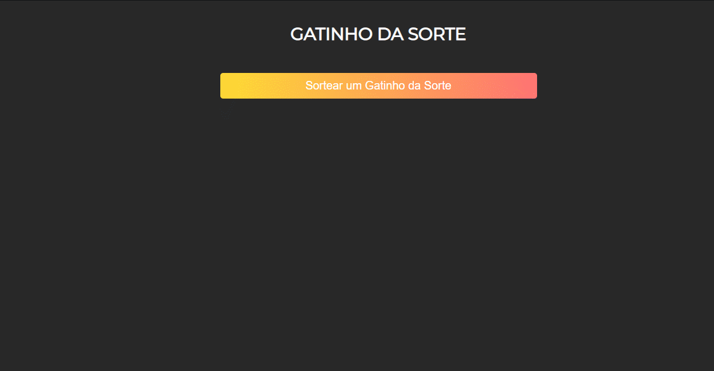

<h4 align="center"> 
	🐱  Gatinho da Sorte 🐱
</h4>

## 💻 Sobre o projeto

Eu tive a idéia desse projeto enquanto estva procurando estudar sobre como consumir APIs,
encontrei uma api de foto de gatos e tive a idéia de fazer algo parecido como biscoito da sorte <strong> só que com gatinhos </strong>

---
<br>

## ⚙️ Funcionalidades
- [x] Você pode sortear um gatinho ao clicar no botão "Sortear um gatinho da sorte".
---
<br>

## 💻 Demosntração
<a href="">
  
</a>

---

## 🚀 Como executar o projeto

### Pré-requisitos
Antes de tudo, é preciso cerfiticar-se que você tenha instalado na sua máquina as seguintes ferramentas: 
[Git](https://git-scm.com), [Node.js](https://nodejs.org/en/) e um editor de código. Sugiro: [VSCode](https://code.visualstudio.com/)

#### 🎲 Início

```bash

# Clone este repositório
$ git clone https://github.com/ndluz/gatinho-da-sorte.git

# Instale as dependências
$ npm install

# Execute a o arquivo principal
$ npm start

```

### ❗ Aviso:
 O app estará rodando na porta 3000, certifique-se de que nenhuma aplicação esteja utilizando essa porta na sua máquina!

---

## 🛠 Tecnologias

As seguintes ferramentas foram usadas na construção do projeto:


-   **[Express](https://expressjs.com/pt-br/)** - Utilizado para criar o setup do servidor
-   **[Cataas](https://cataas.com/#/)** - Api com as fotos de gatos
<br>